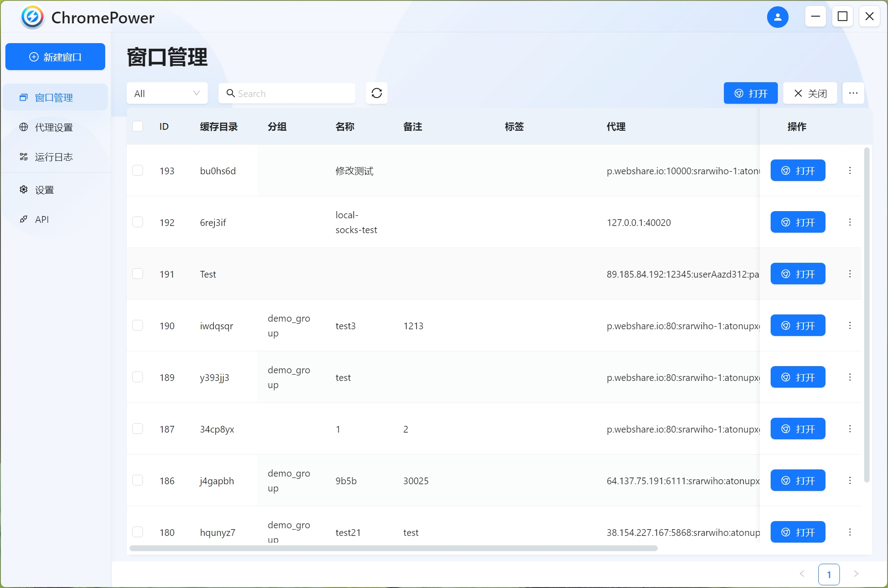

# Chrome Power

---

首款开源~~指纹浏览器~~ Chrome 多开管理工具。基于 Puppeteer、Electron、React 开发。

此软件遵循 AGPL 协议，因此如果你想对其进行修改发布，请保持开源。

Chromium 源码修改请参考 [chrome-power-chromium](https://github.com/zmzimpl/chrome-power-chromium)

## 免责声明

本代码仅用于技术交流、学习，请勿用于非法、商业用途。本代码只承诺不保存任何用户数据，不对用户数据负任何责任，请知悉。

## 开始

按照以下步骤开始使用此软件：

- 下载安装包[点击此处下载](https://github.com/TangNPC/chrome-power-app/releases)
- 建议前往设置页面设置你的缓存目录。
- 创建代理
- 创建窗口
  - 创建空白窗口
  - 导入窗口
    - 从模板导入
    - 从 AdsPower 导入

## 功能

- [x] 多窗口管理
- [x] 代理设置
- [x] 中英文支持
- [x] Puppeteer/Playwright/Selenium 接入
- [x] ~~支持 cookie 导入~~
- [x] Mac 安装支持
- [x] 扩展程序管理
- [x] 同步操作
- [ ] 自动化脚本

## 本地运行/打包

环境：Node v18.18.2， npm 9.8.1

- 安装依赖 `npm i`
- 运行调试 `npm run watch`
- （非必要）打包部署 `npm run package`，注意打包时要把开发环境停掉，不然会导致 sqlite3 的包打包不了

## API 文档

[Postman API](https://documenter.getpostman.com/view/25586363/2sA3BkdZ61#intro)

## FAQ

### 缓存目录如何设置

在设置页面，点击缓存目录，选择你的缓存目录，然后点击确定。注意：缓存目录不要设置在 C 盘以及安装目录，否则更新可能导致缓存目录丢失。

### Windows 10 安装之后闪退

如遇闪退，尝试在安装完成之后，右键启动程序 - 属性，在目标的末尾加入 --no-sandbox 或者 --in-process-gpu，再尝试启动

### 代理无法使用

目前代理只支持 socks5 和 http, 请检查代理格式是否正确，本地代理是否开启 TUN mode 和 Global mode。请在检查后提起 issue 或者联系作者。

### Mac 自动排列无法使用

Mac 自动排列需要辅助功能权限，可以查看运行日志，如果提示缺少权限，请在设置 - 辅助功能中开启。

